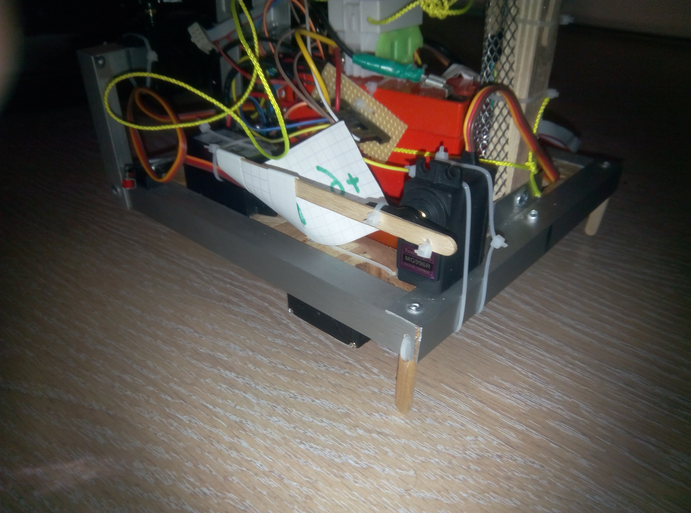

# Wall Follower robot

Ce robot est un robot qui a participé à la coupe de France de robotique.

Homologué, il a marqué 60 points lors de son cinquième match (https://youtu.be/ktbBJQwZ2Vw).

Mais le plus important, est qu'il a été entièrement conçu et fabriqué à la coupe en 1J :)

## Fonctionnement

Ce robot a le fonctionnement le plus simple du monde : il suit le mur jusqu'au bout.

En longeant le mur, on ouvre le distributeur d'eau, et on met de l'eau partout sur le terrain.
Ensuite, on arrive au bout du terrain, et on pousse l'abeille pour qu'elle aille éclater le ballon.

## Mécanique

N'ayant pas de roue, nous avons récupéré et découpé des éco-cups pour faire des roues de robot (https://youtu.be/29PFeRCIXIA).

Les bras pour pousser l'abeille, le jumper de démarrage et beaucoup d'autres pièces sont faites en touillettes à café.
L'avantage de la touillette à café, c'est que si elle casse, on peut la remplacer facilement (https://youtu.be/W_WA3qEpbDU).

Et quand le robot bascule parce qu'il y a trop d'eau dans le distributeur, on rajoute 2 demi-touillettes à l'arrière qui servent de cales pour l'empécher de basculer (https://youtu.be/ImjJ3YZh8-0).

Et on ne comptera pas le nombre de collier plastique dans le robot ...

## Electronique

Très simple :
* 2 Servo-moteurs débridés qui servent de moteur
* 2 Servo-moteurs pour pousser l'abeille
* 1 Servo-moteur pour le drapeau qui affiche le nombre de points
* 1 time of flight pour détecter l'adversaire
* 3 interrupteurs à galet pour détecter les murs
* 1 batterie au plomb (parce qu'il faut allourdir le robot)
* Un arduino pour les controler tous
* Et surtout, beaucoup beaucoup de fil

## Software

* 300 lignes de code avec arduino
